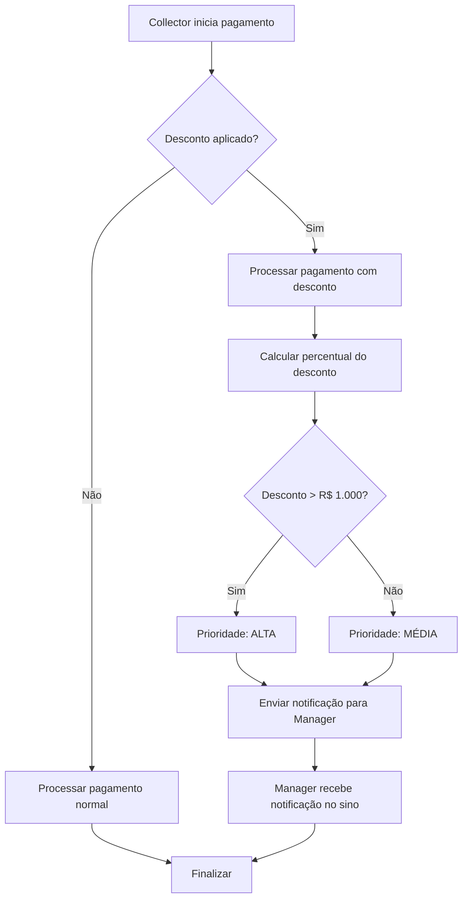

# Sistema de Notificações para Pagamentos com Desconto

## 📋 Funcionalidade Implementada

### Objetivo

Notificar automaticamente o **Manager** sempre que um **Collector** realizar um pagamento com desconto em qualquer venda.

### Como Funciona

#### 🔔 **Notificação Automática**

- **Quando**: Sempre que um collector quitar uma venda aplicando desconto
- **Para quem**: Todos os usuários com tipo "manager"
- **Onde**: Sistema de notificações existente (sino no header)

#### 📊 **Informações na Notificação**

```
Título: "Pagamento com Desconto Aplicado"

Mensagem: "[Nome do Cobrador] aplicou desconto de R$ X,XX (Y,Y%)
no cliente [Nome do Cliente].
Valor pago: R$ A,AA | Valor original: R$ B,BB"
```

#### ⚠️ **Prioridade da Notificação**

- **Alta prioridade**: Descontos acima de R$ 1.000,00
- **Média prioridade**: Descontos até R$ 1.000,00

### 🎯 **Cenários de Ativação**

1. **Pagamento Integral com Desconto**
   - Cliente deve R$ 1.500,00
   - Collector aceita R$ 1.200,00 para quitar
   - ✅ Notificação enviada: "Desconto de R$ 300,00 (20%)"

2. **Pagamento Parcial com Desconto**
   - Cliente deve R$ 2.000,00
   - Collector aceita R$ 800,00 para uma parte das vendas
   - ✅ Notificação enviada: "Desconto de R$ 200,00 (10%)"

3. **Pagamento sem Desconto**
   - Cliente paga valor exato ou valor parcial sem desconto
   - ❌ Nenhuma notificação enviada

### 📁 **Arquivos Modificados**

#### `GeneralPaymentModal.tsx`

```typescript
// Adicionado import
import { useNotifications } from "../../contexts/NotificationContext";

// Adicionado hook
const { addNotification } = useNotifications();

// Nova função
const notifyManagerAboutDiscount = (discountAmount, totalSalesWithDiscount) => {
  // Lógica de notificação
};

// Integração nos fluxos de pagamento
// - handleSubmit() - Pagamentos integrais
// - handleConfirmReschedule() - Pagamentos parciais
```

### 🔧 **Detalhes Técnicos**

#### **Condições para Envio**

```typescript
if (
  user.type === "collector" && // Apenas coletores
  discountAmount > 0 && // Desconto aplicado
  totalDiscountApplied > 0 // Valor total com desconto
) {
  // Enviar notificação
}
```

#### **Cálculo do Percentual**

```typescript
const discountPercentage = (
  (discountAmount / originalPendingAmount) *
  100
).toFixed(1);
```

#### **ID Único da Notificação**

```typescript
relatedId: `discount-${clientGroup.document}-${Date.now()}`;
```

### 🎨 **Interface Visual**

#### **Ícone da Notificação**

- 💰 Tipo: "payment" (ícone de dólar verde)

#### **Aparência no Dropdown**

- **Alta prioridade**: Borda vermelha, fundo vermelho claro
- **Média prioridade**: Borda amarela, fundo amarelo claro

### 📱 **Responsividade**

- ✅ Funciona em dispositivos móveis
- ✅ Funciona em desktop
- ✅ Mesma experiência em ambos

### 🔄 **Fluxo Completo**



### 🎛️ **Configurações**

#### **Limite para Alta Prioridade**

```typescript
priority: discountAmount > 1000 ? "high" : "medium";
```

#### **Campos Obrigatórios**

- Nome do collector
- Nome do cliente
- Valor do desconto
- Valor pago
- Valor original

### 📈 **Benefícios**

1. **Controle Financeiro**
   - Manager tem visibilidade em tempo real
   - Acompanhamento de descontos aplicados

2. **Auditoria**
   - Histórico completo de descontos
   - Rastreabilidade por collector

3. **Gestão de Equipe**
   - Identificação de padrões de desconto
   - Feedback para treinamento

4. **Transparência**
   - Processo transparente
   - Comunicação automática

### 🔮 **Próximas Melhorias Sugeridas**

1. **Dashboard de Descontos**
   - Relatório consolidado de descontos
   - Gráficos por período/collector

2. **Limites de Desconto**
   - Configuração de limites máximos
   - Aprovação prévia para grandes descontos

3. **Alertas Personalizados**
   - Configuração de thresholds
   - Notificações por WhatsApp/email

4. **Análise de Performance**
   - Correlação desconto x recuperação
   - ROI dos descontos aplicados

### 📋 **Como Testar**

1. Fazer login como **collector**
2. Acessar cliente com pendências
3. Abrir modal "Distribuir Pagamento"
4. Inserir valor menor que o devido
5. Marcar checkbox "Pagamento com desconto"
6. Confirmar pagamento
7. Fazer login como **manager**
8. Verificar notificação no sino

---

**Implementado em**: October 31, 2025  
**Versão**: 1.0  
**Status**: ✅ Funcional
